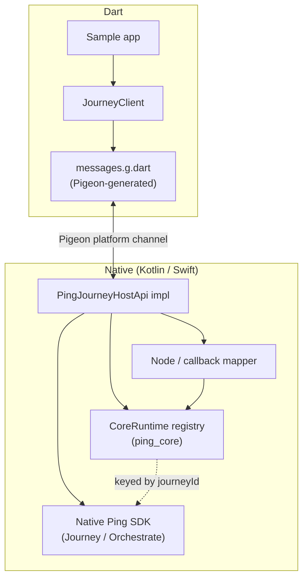
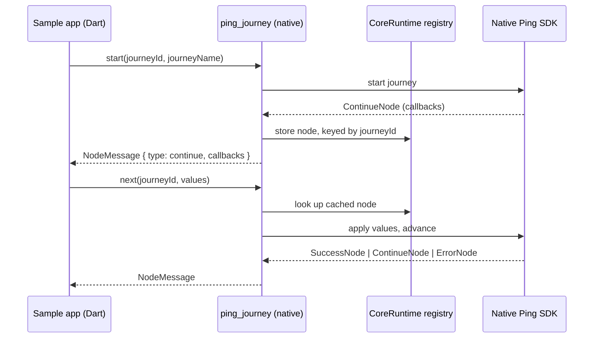

# flutter-sdk-bridge

A native-wrapper bridge exposing the Ping Orchestration SDKs to Flutter, built with [Pigeon](https://pub.dev/packages/pigeon) for type-safe Dart ⇄ Kotlin ⇄ Swift codegen.

## Packages

- **`ping_core`** — a federated native plugin carrying the shared, process-wide `CoreRuntime` registry (keyed native handles for live SDK objects that never cross the platform channel) plus small shared helpers (`PingException`, JSON codec). It exposes **no Pigeon `HostApi`** — it exists purely so multiple SDK modules can share one native registry singleton.
- **`ping_journey`** — a federated plugin carrying the Pigeon schema (`pigeons/messages.dart`), the generated Dart/Kotlin/Swift code, and the native Journey orchestration logic (`JourneyClientFactory`, `JourneyConfigParser`, `JourneyHostApiImpl`, node/callback mappers, error mapper). Depends on `ping_core` at both the Dart and native levels, and on the native Ping Journey SDK (Android `com.pingidentity.sdks:journey`, iOS SPM `PingJourney`).

## Architecture

The bridge is a **native-wrapper**, not a pure-Dart reimplementation: the published native iOS/Android Ping SDKs do the real work (auth flow orchestration, token handling, secure storage), and the Flutter side is a thin, type-safe layer on top, generated with [Pigeon](https://pub.dev/packages/pigeon).

Two things make this different from a typical single-package Flutter plugin:

- **Federated split** — `ping_core` carries a shared native registry with no Pigeon API of its own; `ping_journey` (and future `ping_davinci`, `ping_oidc`, ...) each carry their own Pigeon `HostApi` and depend on `ping_core` for the shared registry.
- **Native handle registry** — live native SDK objects (a `Journey`, a `ContinueNode`) never cross the platform channel. They stay in a process-wide native singleton (`CoreRuntime`), keyed by a UUID. Only that id, plus a flat serialized snapshot of the node, crosses to Dart.

Each turn of a journey follows the same round trip: Dart calls `next()` with the values the user entered,
native resolves the cached node from the registry, applies the values to the real SDK callbacks, advances
the flow, and serializes whatever comes back into a flat `NodeMessage`.

Because nodes and callbacks cross the channel as flat, tagged messages (`{ type, index, ... }`), the Dart
side re-inflates them into a `sealed class` hierarchy and dispatches over it with exhaustive switch
expressions — the UI never has to know how a callback was represented on the wire.

## Native SDK version

Both platforms pin the native Ping SDKs to **2.0.0** — Android via Maven
(`com.pingidentity.sdks:*`), iOS via Swift Package Manager
(`github.com/ForgeRock/ping-ios-sdk`, exact `2.0.0`).

## Adding new modules (e.g. `ping_davinci`, `ping_oidc`)

1. Scaffold a new federated plugin (`flutter create --template=plugin ...`) alongside `ping_journey`, named `ping_<module>`.
2. Depend on `ping_core` at both levels — Dart (`pubspec.yaml` path dependency), Android (`implementation project(':ping_core')`), iOS SPM (a local `Package.swift` path dependency).
3. Register a module-specific `NativeHandle` in `CoreRuntime` if the module needs to share live native handles with another module (add a new registry slot to `CoreRuntime`, mirroring `journeyRegistry`).
4. Author a Pigeon schema under `ping_<module>/pigeons/messages.dart`. Message type names must not use the literal `Pigeon` prefix — Pigeon reserves it for its own generated helpers; this repo's convention is a `*Message` suffix instead (see `ping_journey`'s schema).
5. Regenerate with `dart run pigeon --input pigeons/messages.dart` from the new package's directory, and check in the generated `.g.*` files.
6. Add the new package to the workspace root `pubspec.yaml`'s `workspace:` list.

## License

This software may be modified and distributed under the terms of the MIT license. See the LICENSE file for details.

© Copyright 2026 Ping Identity Corporation. All rights reserved.
