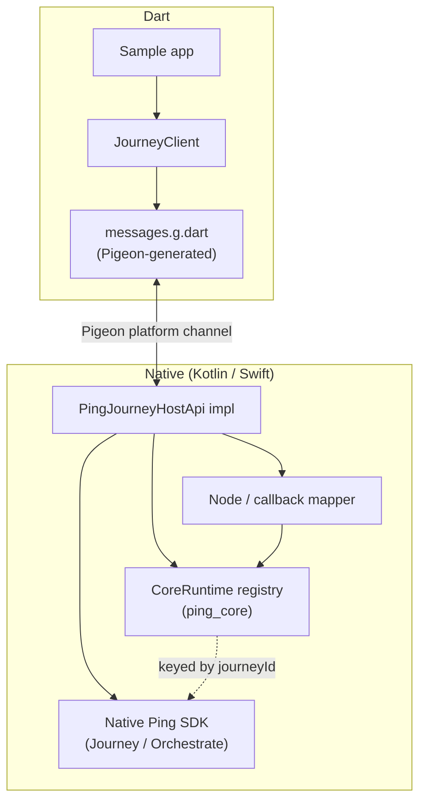
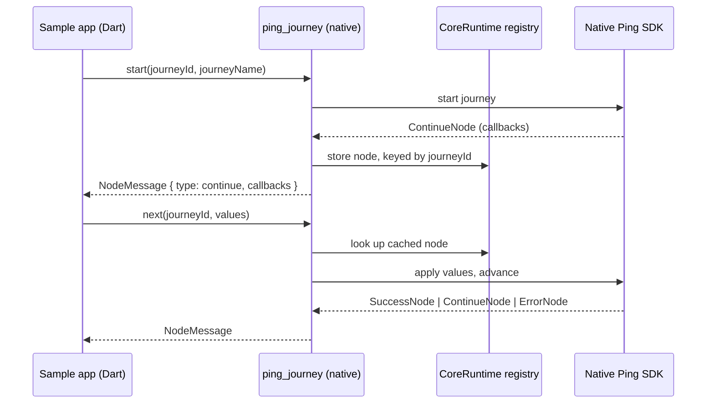
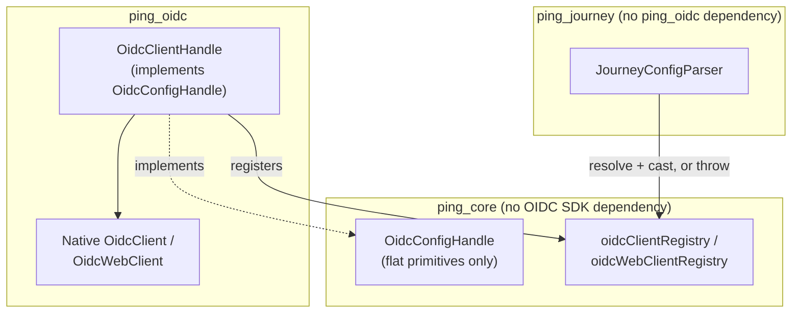

[](https://github.com/ForgeRock/sdk-sample-apps)

# flutter-sdk-bridge

A native-wrapper bridge exposing the Ping Orchestration SDKs to Flutter, built with [Pigeon](https://pub.dev/packages/pigeon) for type-safe Dart ⇄ Kotlin ⇄ Swift codegen.

## Packages

- **`ping_core`** — a federated native plugin carrying the shared, process-wide `CoreRuntime` registry (keyed native handles for live SDK objects that never cross the platform channel) plus small shared helpers (`PingException`, JSON codec). It exposes **no Pigeon `HostApi`** — it exists purely so multiple SDK modules can share one native registry singleton. It also carries the **OIDC seam** (`OidcConfigHandle`, `OidcOpenIdConfig`, and the `oidcClientRegistry`/`oidcWebClientRegistry` slots) described below, so any module can consume a configured OIDC client without depending on `ping_oidc` directly.
- **`ping_journey`** — a federated plugin carrying the Pigeon schema, the generated Dart/Kotlin/Swift code, and the native Journey orchestration logic (`JourneyClientFactory`, `JourneyConfigParser`, `JourneyHostApiImpl`, node/callback mappers, error mapper). Depends on `ping_core` at both the Dart and native levels, and on the native Ping Journey SDK (Android `com.pingidentity.sdks:journey`, iOS SPM `PingJourney`).
- **`ping_oidc`** — a federated plugin for standalone, browser-based centralized OIDC login (configure → authorize → token/refresh/userInfo/revoke/signOff). Carries its own Pigeon schema and native `OidcClientFactory`/`OidcWebClientFactory`/`OidcConfigParser`/`OidcHostApiImpl`/error mapper. Depends on `ping_core` (both for the shared registry and to *implement* `OidcConfigHandle`, so `ping_journey` can resolve a `ping_oidc`-configured client with no compile-time dependency on this package), and on the native Ping OIDC SDK (Android `com.pingidentity.sdks:oidc`, iOS SPM `PingOidc`) plus the native browser module (Android `com.pingidentity.sdks:browser`, iOS SPM `PingBrowser`).

## Architecture

The bridge is a **native-wrapper**, not a pure-Dart reimplementation: the published native iOS/Android Ping SDKs do the real work (auth flow orchestration, token handling, secure storage), and the Flutter side is a thin, type-safe layer on top, generated with [Pigeon](https://pub.dev/packages/pigeon).

Two things make this different from a typical single-package Flutter plugin:

- **Federated split** — `ping_core` carries a shared native registry with no Pigeon API of its own; `ping_journey` (and future `ping_davinci`, `ping_oidc`, ...) each carry their own Pigeon `HostApi` and depend on `ping_core` for the shared registry.
- **Native handle registry** — live native SDK objects (a `Journey`, a `ContinueNode`) never cross the platform channel. They stay in a process-wide native singleton (`CoreRuntime`), keyed by a UUID. Only that id, plus a flat serialized snapshot of the node, crosses to Dart.



Each turn of a journey follows the same round trip: Dart calls `next()` with the values the user entered,
native resolves the cached node from the registry, applies the values to the real SDK callbacks, advances
the flow, and serializes whatever comes back into a flat `NodeMessage`.



Because nodes and callbacks cross the channel as flat, tagged messages (`{ type, index, ... }`), the Dart
side re-inflates them into a `sealed class` hierarchy and dispatches over it with exhaustive switch
expressions — the UI never has to know how a callback was represented on the wire.

### The shared OIDC seam (`ping_core`)

`ping_oidc` is a **credential-store bridge**, not a state-machine bridge like `ping_journey` — it forwards
calls (`token`, `refresh`, `userInfo`, `revoke`, `signOff`) and returns results; native owns all session
state. Configuring OIDC is comparatively expensive (a discovery document, a browser-capable client), and
more than one module can legitimately want the *same* configured client — most concretely, `ping_journey`'s
own post-login token exchange. Repeating every OIDC field on every module's own config message would work,
but it means two independently-configured clients for what should be one logical session.

The solution: `ping_core` declares a **primitives-only** `OidcConfigHandle` interface/protocol — flat fields 
only, no `com.pingidentity.oidc.*`/`PingOidc` type ever appears in its signature — plus two registry slots,
`oidcClientRegistry` and `oidcWebClientRegistry`, alongside the pre-existing `journeyRegistry`. `ping_oidc`'s
`OidcClientHandle` implements that interface and registers itself there. A module that wants to *consume* a
shared OIDC client — `ping_journey`'s `JourneyConfigMessage.oidcClientId` is the only one that does today —
resolves the id from `CoreRuntime.oidcClientRegistry`, casts to `OidcConfigHandle`, and reads it back as flat
values, with **no dependency on `ping_oidc` at either the Dart or native level**. If the app never installed
`ping_oidc`, the cast simply fails and the consumer throws a clear "OIDC client instance not found for id=…"
error instead of a link-time failure.



This is why `ping_journey`'s own build files declare no dependency on `ping_oidc`, and why
`ping_journey/example` — which has zero `ping_oidc` in its dependency graph — is the thing that proves the
independence actually holds, not just a doc claim.

## Native SDK version

Both platforms pin the native Ping SDKs to **2.1.0** — Android via Maven
(`com.pingidentity.sdks:*`), iOS via Swift Package Manager
(`github.com/ForgeRock/ping-ios-sdk`, exact `2.1.0`).

## Testing

Both test tiers live in the bridge modules. The sample apps ship **no tests at all** — they are reference
code customers read and copy, so the behavioural guarantees belong here instead.

**Unit tests** are pure Dart under `<module>/test/`, mock the Pigeon-generated host API, and run on the host
VM. `flutter test` only tests the package in the current directory — it does not aggregate across a pub
workspace — so run it from the workspace root against the module test directories directly.

**Integration tests** are under `<module>/example/integration_test/` and run on a real device or emulator
against the real native Ping SDK. They drive the module's public Dart API directly with **no UI interaction**
— no `pumpWidget`, no finders, no taps; `testWidgets` appears only because
`IntegrationTestWidgetsFlutterBinding` requires it. The `example/` app exists for one reason: the
`integration_test` package can only run from a Flutter *application*, and a plugin is not one. Its
`lib/main.dart` is a deliberately empty screen, and it is registered in the workspace root's `workspace:`
list. It is not a sample app.

Integration tests are **hermetic by default**, scripted against an in-process mock server bound to loopback,
and switch to a live tenant when `--dart-define` values are supplied. Credentials are read through
`String.fromEnvironment`, so they live in your shell or a CI secret store and are never written to a file in
this repository.

```sh
cd flutter && flutter test flutter-sdk-bridge/*/test              # all unit tests
cd flutter-sdk-bridge/ping_journey/example && flutter test integration_test/   # hermetic, needs a device
cd flutter-sdk-bridge/ping_oidc/example && flutter test integration_test/      # hermetic, needs a device
```

See [`ping_journey/example/README.md`](ping_journey/example/README.md) and
[`ping_oidc/example/README.md`](ping_oidc/example/README.md) for each module's mock server, its full
`--dart-define` list, which scenarios skip in which mode, and the platform permissions its test host needs —
the two hosts are *not* scaled copies of one another; `ping_oidc`'s browser-authorize step can't be scripted,
so its hermetic scenarios cover different ground (pre-login behavior, cross-platform "no session" divergence)
than `ping_journey`'s do.

## Adding new modules (e.g. `ping_davinci`)

`ping_journey` and `ping_oidc` are the two working precedents to copy from — read whichever is the closer
shape for the new module (a state machine vs. a credential store, see the OIDC seam section above) before
starting.

1. Scaffold a new federated plugin (`flutter create --template=plugin ...`) alongside `ping_journey`/`ping_oidc`, named `ping_<module>`.
2. Depend on `ping_core` at both levels — Dart (`pubspec.yaml` path dependency), Android (`implementation project(':ping_core')`), iOS SPM (a local `Package.swift` path dependency).
3. Register a module-specific `NativeHandle` in `CoreRuntime` if the module needs to share live native handles with another module (add a new registry slot to `CoreRuntime`, mirroring `journeyRegistry`/`oidcClientRegistry`). If the module needs to *consume* a shared OIDC client the way `ping_journey` does, resolve it via `CoreRuntime.oidcClientRegistry` and cast to `ping_core`'s `OidcConfigHandle` — don't add a direct `ping_oidc` dependency just to read a config.
4. Author a Pigeon schema under `ping_<module>/pigeons/messages.dart`. Message type names must not use the literal `Pigeon` prefix — Pigeon reserves it for its own generated helpers; this repo's convention is a `*Message` suffix instead (see `ping_journey`'s schema). A field literally named `description` is also rejected (Swift `NSObject` collision) — use a more specific name instead.
5. Regenerate with `dart run pigeon --input pigeons/messages.dart` from the new package's directory, and check in the generated `.g.*` files.
6. Add the new package to the workspace root `pubspec.yaml`'s `workspace:` list.
7. Keep the generated `example/` app and strip it back to an empty screen — it is the integration-test host, not a sample. Give it a `README.md` saying so, add it to the `workspace:` list as well, and copy the debug-only Android `network_security_config.xml` and iOS `NSAllowsLocalNetworking` entries from `ping_journey/example` (or `ping_oidc/example`) if the module's tests use a loopback mock server.
8. Write unit tests under `<module>/test/` and no-UI integration scenarios under `<module>/example/integration_test/`, one scenario per file. See the Testing section above.

## License

This software may be modified and distributed under the terms of the MIT license. See the LICENSE file for details.

© Copyright 2026 Ping Identity Corporation. All rights reserved.
