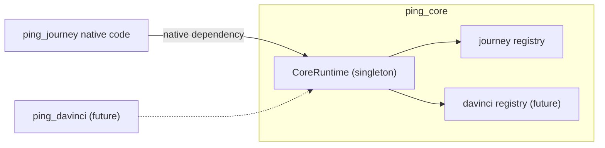

# ping_core

Shared native runtime for the Flutter Ping SDK bridge — see [`../README.md`](../README.md) for the
bridge overview and its architecture diagrams.

This is a federated Flutter plugin with **no Pigeon `HostApi`**. It exposes no callable Dart methods of
its own — instead it exists purely so every SDK module plugin (`ping_journey`, and future
`ping_davinci`/`ping_oidc`) can share one process-wide native registry (`CoreRuntime`) of live SDK
handles, keyed by UUID string. The live objects themselves (a `Journey`, a `ContinueNode`, ...) never
cross the platform channel — only their generated id does.

## Why a plugin, not a plain Dart package

`CoreRuntime` has to be a genuine **native** singleton — one instance per process, reachable from
Kotlin/Swift code in every module plugin that links against it. A pure-Dart package can't provide that:
each platform's native SDK objects are created and consumed entirely on the native side, so the registry
holding them has to live there too. Dart never sees a `Journey` or `ContinueNode` instance directly; it
only ever sees the UUID key.

## What's inside

- **Dart** (`lib/src/`): `ping_exception.dart` — `PingException`, a typed exception that wraps a native
  failure (code + message) so callers don't have to catch platform-specific `PlatformException`;
  `json_codec.dart` — small shared JSON encode/decode helpers used by every module's message layer.
- **Android** (`android/.../flutter/core`, namespace `com.pingidentity.flutter.core`):
  - `CoreRuntime` — a Kotlin `object` (JVM singleton), the single entry point dependents reach for a
    registry instance.
  - `Registry` / `SimpleRegistry` / `NativeHandle` — a minimal keyed store: `put`/`get`/`remove` by UUID
    string, generic over the handle type each module stores in it.
  - `PingCorePlugin` — the `FlutterPlugin` implementation; registers nothing on the Pigeon side, just
    makes the package a loadable native plugin so Gradle/CocoaPods/SPM wire it into the app.
- **iOS** (`ios/ping_core`, Swift Package Manager): the same shapes, Swift-idiomatic —
  - `CoreRuntime` — a Swift `enum` with `static let` storage (no instances, same "one native singleton"
    role as the Kotlin `object`).
  - `Registry` — **actor-isolated**, since Swift concurrency doesn't give a JVM-style single-classloader
    guarantee for free; the actor serializes access to the underlying dictionary instead.
  - `SimpleRegistry`, `NativeHandle`, `PingCorePlugin` — mirror the Android shapes.

## How a module plugin depends on this one

A Dart-level dependency (`pubspec.yaml`) does **not** by itself create a native one — each platform needs
an explicit native link so the dependent's native code can actually call into `CoreRuntime` and share the
*same* singleton instance, not a second copy:

- **Android**: the dependent's `android/build.gradle` adds `implementation project(':ping_core')`. Both
  plugins load in one classloader, so `CoreRuntime` resolves to the same JVM object.
- **iOS (SPM)**: the dependent's `Package.swift` adds `.package(name: "ping_core", path:
  "../../ping_core/ios/ping_core")` and depends on its product. Both plugin packages link the same
  compiled `ping_core` module, so `CoreRuntime`'s `static let` storage is shared.

Each module owns its **own registry slot** inside `CoreRuntime` (e.g. a `journeyRegistry` for
`ping_journey`) rather than sharing one generic store — that keeps one module's handle lifecycle
(creation, lookup, disposal) from leaking into another's.

## Adding a new registry slot

When a new module plugin needs to keep a live native handle around between Pigeon calls (the way
`ping_journey` keeps a `Journey`/`ContinueNode` per `journeyId`), add a new named `Registry` instance to
`CoreRuntime` on both platforms — don't reuse an existing module's slot, and don't route unrelated handle
types through the same registry. See `ping_journey`'s `journeyRegistry` usage in `JourneyHostApiImpl` /
`JourneyClientFactory` for the pattern to copy.

## License

This software may be modified and distributed under the terms of the MIT license. See the LICENSE file for details.

© Copyright 2026 Ping Identity Corporation. All rights reserved.