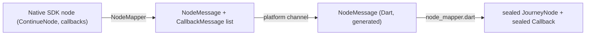

[](https://github.com/ForgeRock/sdk-sample-apps)

# ping_journey

Journey bridge plugin for the Flutter Ping SDK bridge — see [`../README.md`](../README.md) for the bridge overview and its architecture diagrams.

Wraps the native Ping Journey SDK (Android `com.pingidentity.sdks:journey`, iOS SPM `PingJourney`) behind a Pigeon-generated `HostApi`, exposing:

- `JourneyClient.configure(config)` / `.start(name)` — build a native `Journey` and start it.
- `.next(node)` — submit callback values and advance the flow.
- `.user()` / `.signOff()` / `.dispose()` — session/token retrieval, sign-off, cleanup.

Depends on `ping_core` (for the shared `CoreRuntime` registry) at both the Dart and native levels.

## Why a federated plugin, not part of `ping_core`

`ping_journey` carries the one thing `ping_core` deliberately does *not*: a Pigeon `@HostApi` and the native Ping Journey SDK dependency itself. Splitting them means a future `ping_davinci` or `ping_oidc` can depend on `ping_core`'s registry without also pulling in the Journey SDK — each module plugin owns its own wire schema and its own native SDK dependency, and only shares the registry mechanism.

## Wire schema (`pigeons/messages.dart`)

The Pigeon schema is the source of truth for everything crossing the channel — it's a flat, serializable, `@async` HostApi (Pigeon binds one channel at plugin registration).

- `JourneyConfigMessage` — server URL, realm, cookie name, timeout, OIDC fields (client id, discovery endpoint, redirect URI, scopes).
- `StartOptionsMessage` — `forceAuth`, `noSession`.
- `CallbackMessage` — a flat union of every v1 callback's fields (`type`, `index`, `prompt`, `value`, `choices`, `terms`, ...) plus a `raw` escape hatch for anything not modeled explicitly.
- `CallbackValueMessage` — the Dart→native direction: `{ type, index, value }`, addressing the specific callback a value belongs to.
- `NodeMessage` — `{ type: continue|success|error|failure, message?, cause?, callbacks?, ... }`.
- `SessionMessage` — `{ accessToken, refreshToken?, expiresIn, userInfo? }`.
- `PingJourneyHostApi` (`@HostApi`, all methods `@async`) — `configureJourney`, `start`, `next`, `getSession`, `signOff`, `dispose`.

Message type names use a `*Message` suffix (`NodeMessage`, not `PingNode`) — Pigeon reserves the literal `Pigeon` prefix for its own generated helpers and refuses to codegen user types that collide with it.

After editing the schema, regenerate from this directory and check in the generated files:

```sh
dart run pigeon --input pigeons/messages.dart
```

## Node / callback mapping

Native and Dart never share live objects — only the flat messages above. `node_mapper` (native side) and its Dart counterpart translate between the real SDK's node/callback types and the wire format:



On the way back, Dart addresses each answered callback by `{ type, index }` rather than sending a whole object back; native re-resolves that pair against the `ContinueNode` it already has cached in `CoreRuntime` and applies the value to the real callback (`JourneyCallbackValueApplier`) before calling the native SDK's own `next()`.

## Dart public API

The generated Pigeon code (`lib/src/messages.g.dart`) is intentionally low-level — flat messages, no sealed types. `ping_journey.dart` and the rest of `lib/src/` wrap it in the API the sample app actually uses:

- `journey_node.dart` — `sealed class JourneyNode`: `ContinueNode(journeyId, callbacks, header?, description?, stage?)`, `SuccessNode`, `ErrorNode(message, status?)`, `FailureNode(cause)`.
- `callback/*.dart` — `sealed class Callback` and one subclass per v1 callback type (`NameCallback`, `PasswordCallback`, `ChoiceCallback`, `KbaCreateCallback`, `TermsAndConditionsCallback`, ...), each exposing a mutable field the UI sets and a `toValue()` that produces a `CallbackValueMessage` (`null` for output-only callbacks like `TextOutputCallback`).
- `journey_client.dart` — `JourneyClient`: `.configure(JourneyConfig)`, `.start(name, {forceAuth, noSession})`, `.next(ContinueNode)`, `.user()`, `.signOff()`, `.dispose()`. This is the type the sample app's repository layer depends on.
- `node_mapper.dart` — `NodeMessage` → sealed `JourneyNode` via a switch expression on `NodeType` (exhaustiveness checked by `dart analyze`), re-inflating each `CallbackMessage` into its typed `Callback` subclass.
- `callback_helpers.dart` — pure logic (no platform calls) deciding which widget a callback renders as and whether it's interactive or output-only.
- Native failures surface as `PlatformException` and are caught and rethrown as `ping_core`'s typed `PingException`, so callers never need to know a platform channel is involved.

## Native implementation shape

Both platforms follow the same layering, so a change on one side has an obvious counterpart on the other:

| Concern | Android | iOS |
|---|---|---|
| Pigeon-generated types | `Messages.g.kt` | `Messages.g.swift` |
| Plugin registration | `PingJourneyPlugin.kt` | `PingJourneyPlugin.swift` |
| `HostApi` implementation | `JourneyHostApiImpl.kt` | `JourneyHostApiImpl.swift` |
| Build a native `Journey` from config | `JourneyClientFactory.kt` / `JourneyConfigParser.kt` | `JourneyClientFactory.swift` / `JourneyConfigParser.swift` |
| Node → wire message | `mapper/JourneyNodeMapper.kt` | `Mapper/JourneyNodeMapper.swift` |
| Wire values → callback | `callback/JourneyCallbackValueApplier.kt` | `Callback/JourneyCallbackValueApplier.swift` |
| Native error → wire error | `error/JourneyErrorMapper.kt` | `Error/JourneyErrorMapper.swift` |

`ErrorNode.status` is present on iOS but has no Android equivalent, hence nullable on the wire — a platform difference in the native SDKs themselves, not a bridge limitation.

## Build / dependency wiring

- **Android**: `namespace 'com.pingidentity.flutter.journey'`, `minSdk 29`, `compileSdk 36`, Java 17; `implementation project(':ping_core')` + `implementation 'com.pingidentity.sdks:journey:2.0.0'` (pulls in orchestrate/oidc/storage transitively) + `kotlinx-coroutines-android`.
- **iOS (SPM)**: platform `.iOS(.v16)`; dependencies = local `ping_core` package + `.package(url: "https://github.com/ForgeRock/ping-ios-sdk", exact: "2.0.0")`; the target links the `PingJourney` product, which transitively pulls in `PingOrchestrate`/`PingOidc`. A CocoaPods podspec is kept as an optional fallback for host apps not yet on SPM.
- Native SDK version is pinned to **2.0.0** on both platforms — see [`../README.md`](../README.md).

## License

This software may be modified and distributed under the terms of the MIT license. See the LICENSE file for details.

© Copyright 2026 Ping Identity Corporation. All rights reserved.